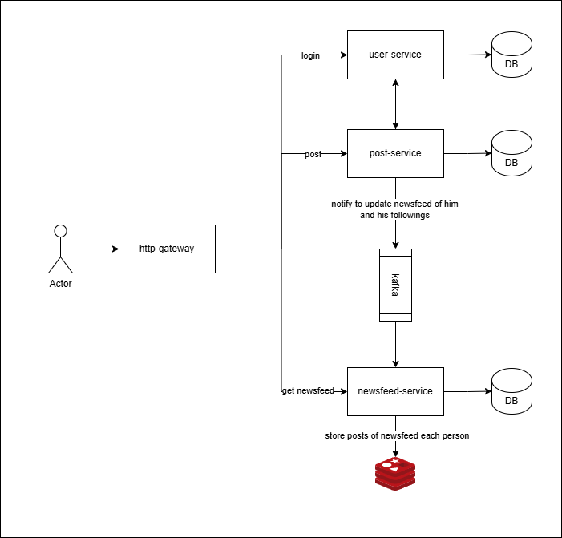

# This is social netword demo by Golang

# 1. Technologies

    1. grpc - "google.golang.org/grpc"
    2. goqu - "github.com/doug-martin/goqu/v9"
    3. kafka - "github.com/IBM/sarama"
    4. redis - "github.com/go-redis/redis/v8"

# 2. How to start

    1. go to "cd deployments" and run "docker-compose up"
    2. run http-gateway "cd http_gateway/" and "go run cmd/main.go"
    3. run user-service "cd user-service/" and "go run cmd/main.go"
    4. run post-service "cd post-service/" and "go run cmd/main.go"
    5. run newsfeed-service "cd newsfeed-service/" and "go run cmd/main.go"

