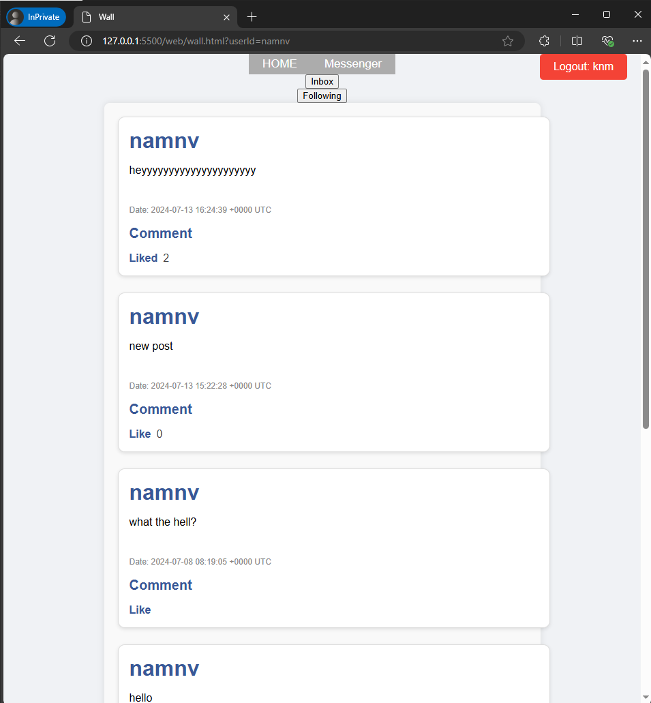

# This is a basic social network demo by Golang.

# 1. Technologies

    1. grpc - "google.golang.org/grpc"
    2. goqu - "github.com/doug-martin/goqu/v9"
    3. kafka - "github.com/IBM/sarama"
    4. redis - "github.com/go-redis/redis/v8"
    5. websocket - "github.com/gorilla/websocket"
    6. gorm - 	"gorm.io/gorm" (post-service only)

# 2. How to start

## Install

    go install github.com/google/wire/cmd/wire@latest

## Docker

    1. run `docker compose up`
    2. Check status of services

## Local

    1. go to "cd deployments" and run "docker-compose up"
    2. run http-gateway "cd http_gateway/" and "go run cmd/main.go"
    3. run user-service "cd user-service/" and "go run cmd/main.go"
    4. run post-service "cd post-service/" and "go run cmd/main.go"
    5. run newsfeed-service "cd newsfeed-service/" and "go run cmd/main.go"
    6. run message-service "cd message-service/" and "go run cmd/main.go"
    7. run FE "cd web/" and "start index.html"

## User

    namnv - namnv
    knm - knm
    baobq - baobq

## Follower

# 3. Data migration

    user-service\internal\database\migrations\mysql

# 4. Demo

## Newsfeed

## View comment

## View followers post

if `namnv` posted a post. `knm` and `baobq` will see it in their newsfeed.

if `knm` posted a post. Only `namnv` will see it in his newsfeed `baobq` will not. Because only `namnv` follow `knm`
if `baobq` posted a post. Only `namnv` will see it in his newsfeed `knm` will not. Because only `namnv` follow `baobq`

Here is redis

## popup in newsfeed

Create new chat room private with friend from newsfeed. Only 2 member of chat can see and join the chat

## Your wall

## Search another people

