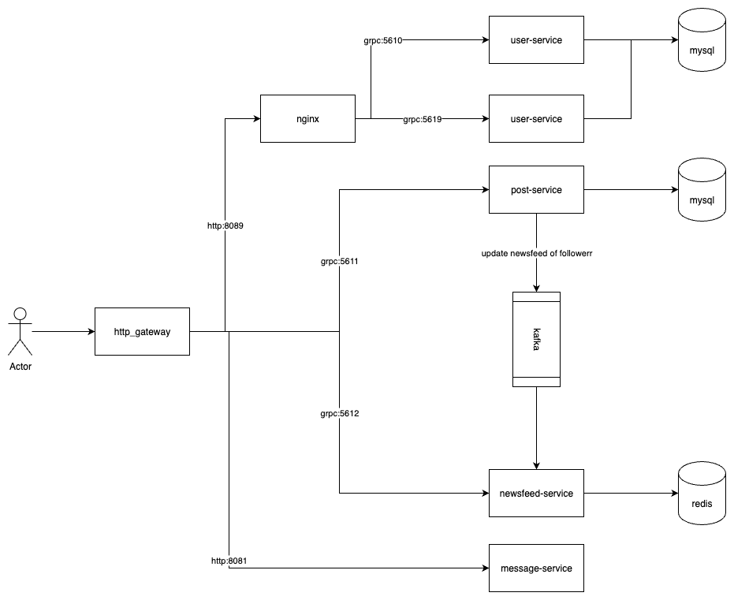

# This is a basic social network demo by Golang.

# 1. Technologies

    1. grpc - "google.golang.org/grpc"
    2. goqu - "github.com/doug-martin/goqu/v9"
    3. kafka - "github.com/IBM/sarama"
    4. redis - "github.com/go-redis/redis/v8"
    5. websocket - "github.com/gorilla/websocket"
    6. gorm - "gorm.io/gorm" (post-service only)
    7. Elastic search - "github.com/elastic/go-elasticsearch/v8"
    8. prometheus - "github.com/prometheus/client_golang/prometheus"
    9. grafana for monitoring
    10. email - "github.com/jordan-wright/email"
    11. sms - "github.com/twilio/twilio-go"
    12. template - "html/template"
    13. DSA: Trie - for violent comment rule checking
    14. Nginx: for load balancing



# 2. How to start

## Run by Docker

    1. run `docker compose up`
    2. Check status of services
    3. Access prometheus: [http://localhost:9090/targets](http://localhost:9090/targets)
    4. Access grafana: [http://localhost:3000/login](http://localhost:3000/login) (user: admin - password: admin)
    5. Access `localhost:3001` for web
    6. Access `localhost:3001/comment_rule.html` for comment-rule

## Run on Local

    1. go to "cd deployments" and run "docker-compose up"
    2. run http-gateway "cd http_gateway/" and "go run cmd/main.go"
    3. run user-service "cd user-service/" and "go run cmd/main.go"
    4. run post-service "cd post-service/" and "go run cmd/main.go"
    5. run newsfeed-service "cd newsfeed-service/" and "go run cmd/main.go"
    6. run message-service "cd message-service/" and "go run cmd/main.go"
    7. run FE "cd web/" and "start index.html"

# 3. Information

### User

    namnv - namnv
    knm - knm
    baobq - baobq


### Follower


### Data migration

sql files location:

    user-service\internal\database\migrations\mysql

### Install wire to generate dependency injection

    go install github.com/google/wire/cmd/wire@latest

# 4. Features

```txt
- Login / Register
- Newsfeed
- View and add new comment on post with comment rule
- View followers post
- Follow / Unfollow
- View your wall and your friends post
- Search another people
- Chat with friends
- Email / SMS OTP
- Notification
```
## 4.1 Login / Register

- Login


- Register


- OTP


## 4.2 Newsfeed 


## 4.3 View and add new comment on post with comment rule

- View comment on post


- Comment violent rule checking


## 4.4 View followers post

if `namnv` posted a post. `knm` and `baobq` will see it in their newsfeed.


if `knm` posted a post. Only `namnv` will see it in his newsfeed `baobq` will not. Because only `namnv` follow `knm`
if `baobq` posted a post. Only `namnv` will see it in his newsfeed `knm` will not. Because only `namnv` follow `baobq`


## 4.5 Follow / Unfollow


## 4.6 View your wall and your friends post

- View your wall


- View your friends post


## 4,.7 Search another people

- Search by name


- Act when search


## 4.8 Chat with friends

- Chat room list


- Chat with friend


## 4.8 Email / SMS OTP

## 4.9 Notification

<!--  -->

# Monitoring


<details>
  <summary>Grafana custom</summary>
after login, you can setup dashboard for monitoring


access to download dashboard template

https://grafana.com/grafana/dashboards/1860-node-exporter-full/


import template by id or json


</details>
