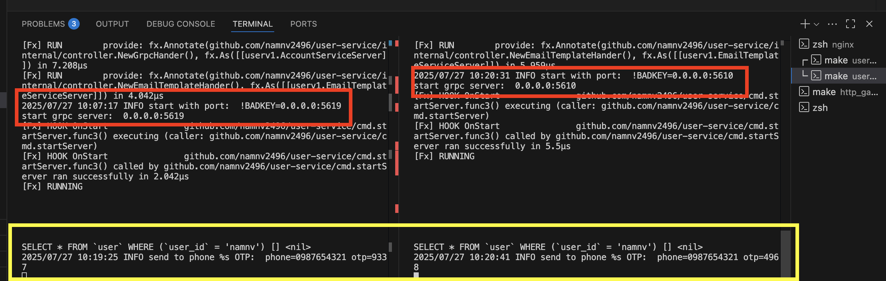

# nginx for routing


```bash
brew install nginx
```

Now can access to nginx config folder in `/opt/homebrew/etc/nginx/nginx.conf`


Request routed balance into 2 pods




# How to enable 

## step 1: Modify to redirect request to nginx in http_gateway

```go
	// connect to user-service
	err = userv1.RegisterAccountServiceHandlerFromEndpoint(
		ctx,
		mux,
		"localhost:8089", // connect to nginx
		opts,
	)
```

## step 2: Start nginx
in terminal

```bash
nginx

ps aux | grep nginx
```

## step 3: Stop nginx

in terminal

```bash
# check
ps aux | grep nginx

nginx -s stop

# check
ps aux | grep nginx
```

